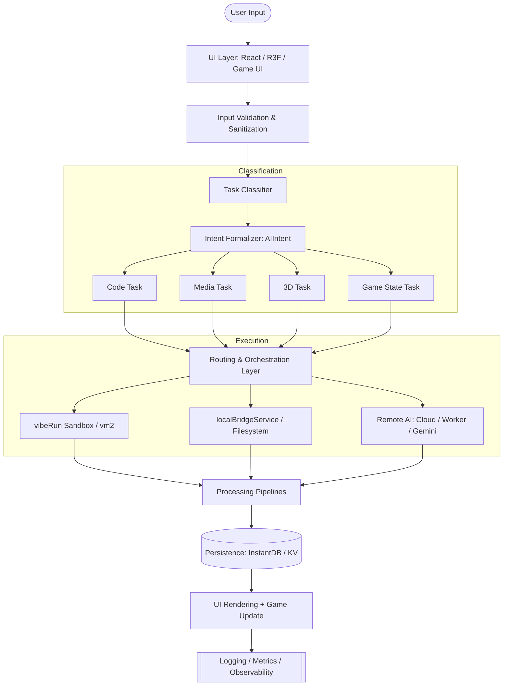
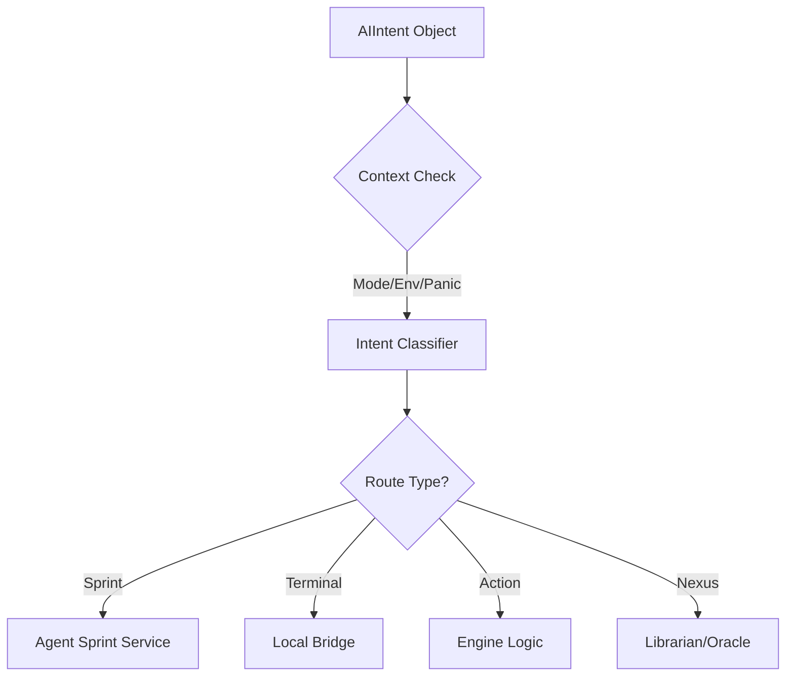
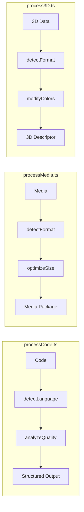
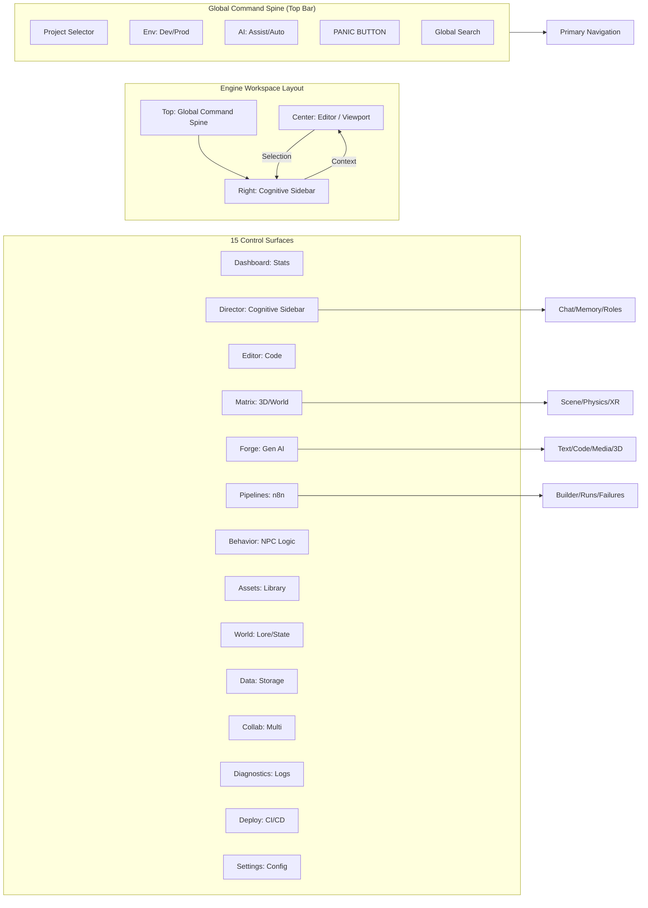

# Antigravity Nexus - System Architecture Spec

This document formalizes the production-grade routing and orchestration layer of the Antigravity / ElderScape hybrid engine.

## 1. High-Level System Topology

## 2. Intent-Driven Orchestration (universalOrchestrator.ts)

The engine dispatches **Structured Intents** instead of raw strings. This ensures context-aware execution.

### AIIntent Schema
- **`source`**: Origin (`omnibar`, `chat`, `direct_button`).
- **`verb`**: Desired operation (`explain`, `refactor`, `generate`).
- **`context`**: Real-time snapshot (`aiMode`, `projectEnv`, `panicState`).
- **`payload`**: Dynamic data (`selection`, `activeFile`, `text`).

## 3. Post-Execution Processing Pipelines

Data is never sent directly to the UI—it is always structured first.

## 5. Nexus UI/UX Command Map

The visual hierarchy of the **Maximal Control Surface**.

## 6. Hard Rules & Constraints

1.  **Strict Routing**: No task bypasses `universalOrchestrator.ts`.
2.  **Zero-Direct-AI**: UI components must never call providers directly.
3.  **Sandboxed Flow**: All browser-side execution must be trapped in `vibeRun`.
4.  **Full Observability**: Every step—from validation to rendering—is logged via `loggingService`.

---

> [!NOTE]
> This diagram is the single source of truth for the Antigravity Engine architecture. Any deviation from this flow is considered an architectural regression.
