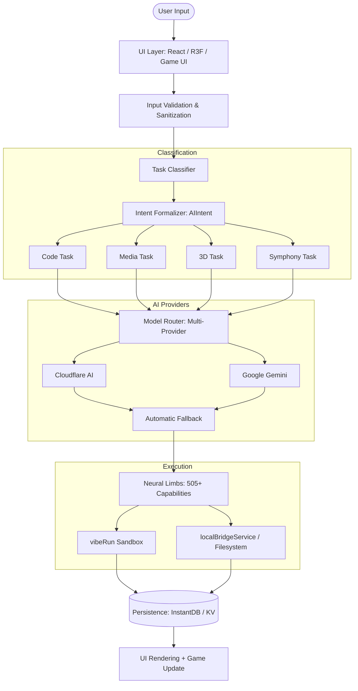
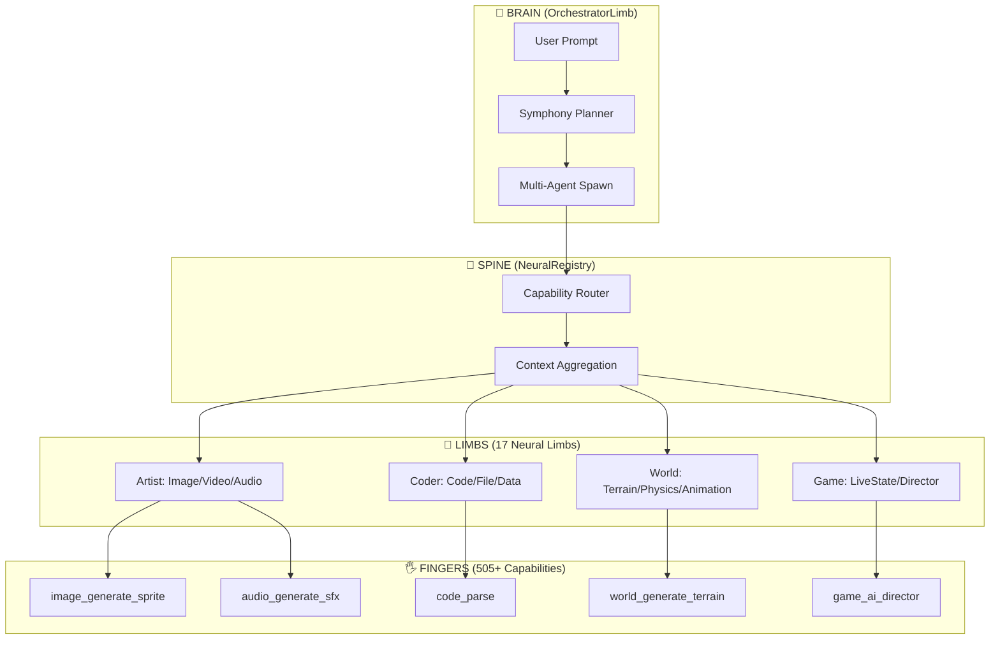
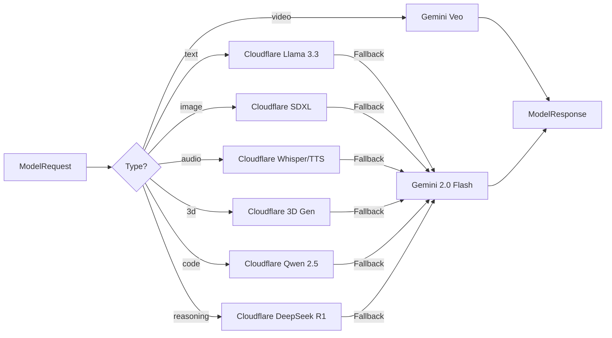
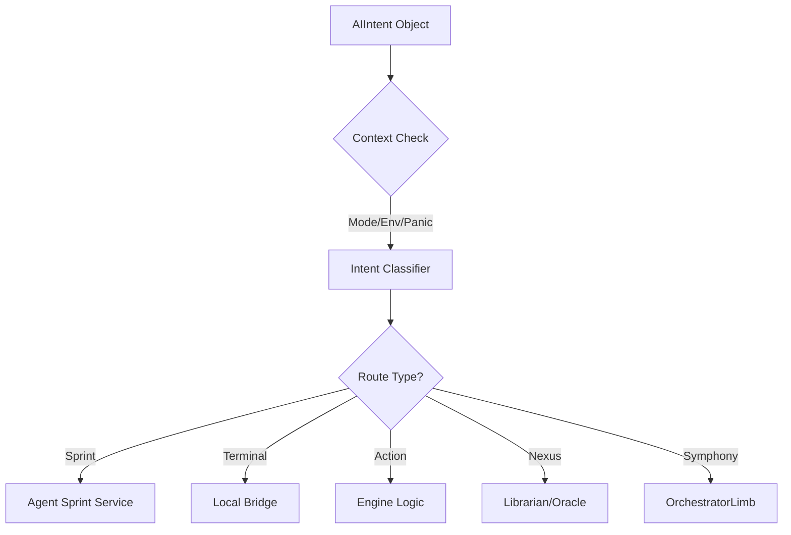

# Antigravity Nexus - System Architecture

This document formalizes the production-grade routing and orchestration layer of the Antigravity Engine.

## 1. High-Level System Topology

## 2. Agent Symphony Architecture

## 3. Model Router Pipeline

## 4. Neural Limbs Registry

| Limb ID | Name | Capabilities | Domain |
|---------|------|--------------|--------|
| `entity` | EntityLimb | 30 | Scene management |
| `file` | FileLimb | 25 | File I/O |
| `data` | DataLimb | 30 | Data processing |
| `mesh` | MeshOpsLimb | 50 | 3D geometry |
| `material` | MaterialLimb | 25 | PBR materials |
| `ai` | AIModelLimb | 30 | AI model access |
| `code` | CodeLimb | 30 | Code operations |
| `world` | WorldLimb | 30 | Environment |
| `physics` | PhysicsLimb | 25 | Simulation |
| `image` | ImageLimb | 35 | Image generation |
| `audio` | AudioLimb | 35 | Audio generation |
| `video` | VideoLimb | 30 | Video generation |
| `animation` | AnimationLimb | 30 | Animation/rigging |
| `network` | NetworkLimb | 20 | HTTP/WebSocket |
| `live_game` | LiveGameLimb | 30 | Real-time state |
| `orchestrator` | OrchestratorLimb | 25 | Multi-agent symphony |
| `asset_pipeline` | AssetPipelineLimb | 26 | Batch asset generation |

## 5. Intent-Driven Orchestration

### AIIntent Schema
- **`source`**: Origin (`omnibar`, `chat`, `direct_button`)
- **`verb`**: Operation (`explain`, `refactor`, `generate`, `symphony`)
- **`context`**: Real-time snapshot (`aiMode`, `projectEnv`, `panicState`)
- **`payload`**: Dynamic data (`selection`, `activeFile`, `text`)

## 6. Hard Rules & Constraints

1. **Strict Routing**: No task bypasses `modelRouter.ts`
2. **Multi-Provider**: Always try Cloudflare first, Gemini fallback
3. **Capability Discovery**: All AI actions go through `NeuralRegistry`
4. **Full Observability**: Every step logged via `loggingService`
5. **Session Quotas**: `sessionService` enforces $5 hard budget limit

---

> [!NOTE]
> This diagram is the single source of truth for the Antigravity Engine architecture.
